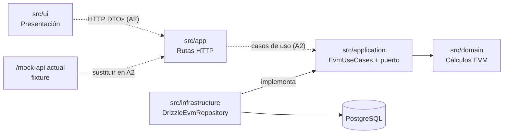

# Arquitectura

La aplicación organiza el análisis EVM por dependencias: el dominio es puro,
la aplicación coordina, infraestructura adapta PostgreSQL y la interfaz solo
presenta el contrato recibido.

## Límites

- `src/domain` contiene fórmulas, consolidación, clasificación y presentación
  resuelta de indicadores; no conoce base de datos ni HTTP.
- `src/application` valida reglas de negocio, normaliza porcentajes de 0–100 a
  fracciones y orquesta el puerto `EvmRepository`; no calcula fórmulas nuevas.
- `src/infrastructure` traduce filas y `numeric` de PostgreSQL a `Decimal` en
  un único mapper e implementa el puerto. Solo persiste datos fuente.
- `src/ui` no importa capas de servidor, no calcula EVM y presenta los datos
  recibidos, incluidos `display`, `status` y `label`.

`phase0/source-boundaries` impide `domain → app|ui|infrastructure`,
`application → app|ui|infrastructure` y
`ui → domain|application|infrastructure`; además, dominio y aplicación no
pueden depender de Next, Drizzle ni `pg`.

## Lectura y cálculo

El flujo previsto de `GET /projects/{projectId}` es:

`ruta A2 → EvmUseCases.getProjectAnalysis → EvmRepository → PostgreSQL →
application.getProjectAnalysis → domain.deriveActivity/consolidateProject →
DTO`.

La aplicación lee los datos capturados, los normaliza y delega todo cálculo y
clasificación al dominio. Los resultados se devuelven, pero no se almacenan.
La ruta HTTP real queda pendiente de A2; hoy sí es ejecutable
`GET /mock-api/projects/{projectId}`, que responde con el fixture y no invoca
los casos de uso ni PostgreSQL.

## Decisiones registradas

| ADR | Aplicación en esta arquitectura |
| --- | --- |
| 001 | Cálculo EVM autoritativo en `domain`. |
| 002 | PostgreSQL guarda solo campos fuente; lecturas derivan indicadores. |
| 003 | `Decimal` interno y porcentajes normalizados antes del dominio. |
| 004 | Indicadores no evaluables se conservan como estado de negocio. |
| 005 | Un proyecto conserva una única foto vigente y fecha de corte. |
| 006a | Recursos REST anidados; su handler se implementa en A2. |
| 006b | DTO de lectura/escritura y conversión de porcentajes en backend. |
| 007 | Tras mutar, A2 recargará `GET /projects/{projectId}`. |
| 008 | La clave foránea de actividades usa borrado en cascada atómico. |
| 009 | Negocio produce violaciones; A2 las traduce a HTTP 400/404/422. |
