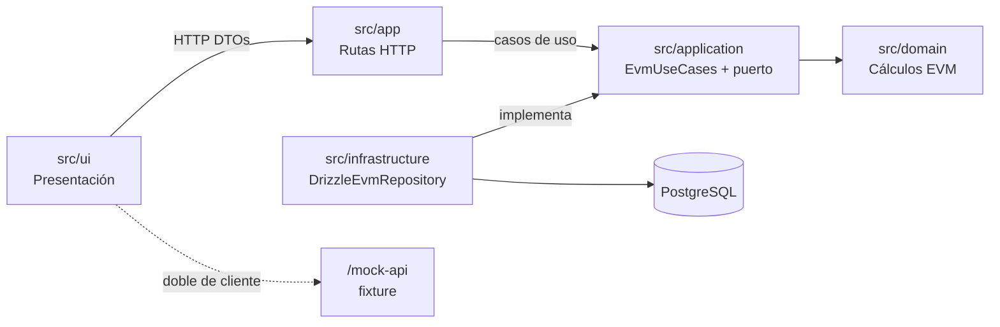

# Arquitectura

La aplicación organiza el análisis EVM por dependencias: el dominio es puro,
la aplicación coordina, infraestructura adapta PostgreSQL y la interfaz solo
presenta el contrato recibido.

## Límites

- `src/domain` contiene fórmulas, consolidación, clasificación y presentación
  resuelta de indicadores; no conoce base de datos ni HTTP.
- `src/application` valida reglas de negocio, normaliza porcentajes de 0–100 a
  fracciones y orquesta el puerto `EvmRepository`; no calcula fórmulas nuevas.
- `src/infrastructure` traduce filas y `numeric` de PostgreSQL a `Decimal` en
  un único mapper e implementa el puerto. Solo persiste datos fuente.
- `src/ui` no importa capas de servidor, no calcula EVM y presenta los datos
  recibidos, incluidos `display`, `status` y `label`.
- La presentación se reparte: el backend resuelve display de CPI y SPI, porque
  el marcador es lógica de negocio; los montos cruzan sin redondear y los
  formatea la interfaz, porque redondear a dos decimales es formato.

`phase0/source-boundaries` impide `domain → app|ui|infrastructure`,
`application → app|ui|infrastructure` y
`ui → domain|application|infrastructure`; además, dominio y aplicación no
pueden depender de Next, Drizzle ni `pg`.

## Por qué la frontera está aquí

Los indicadores EVM se calculan una sola vez, en `src/domain`, y viajan
resueltos: `value`, `display`, `status` y `label`. La interfaz los presenta;
no los deriva.

La alternativa natural en un proyecto Next.js sería calcular en el cliente
para que el dashboard reaccione sin esperar al servidor. Se descartó porque
duplicaría las reglas en dos lenguajes de ejecución: la banda neutral
0,99–1,01, los marcadores `<0,99` y `>1,01`, el redondeo con empates
alejándose de cero y la distinción entre un CPI de cero definido y uno no
evaluable. Dos implementaciones de esas reglas divergen; la única forma barata
de garantizar que no ocurra es que exista una sola.

El precio es que la interfaz no obtiene resultados durante la digitación:
espera a confirmar la edición y a la respuesta del backend. Es coherente con
RF-03, que exige exactamente ese comportamiento.

Como aquí front y back comparten repositorio y lenguaje, la separación no la
impone la ejecución en procesos distintos: la impone `phase0/source-boundaries`,
que hace fallar la construcción si `src/ui` importa `src/domain`.

## Lectura y cálculo

El flujo ejecutable de `GET /projects/{projectId}` es:

`src/app/projects/[projectId]/route.ts → EvmUseCases.getProjectAnalysis →
DrizzleEvmRepository/EvmRepository → PostgreSQL →
application.getProjectAnalysis → domain.deriveActivity/consolidateProject →
ProjectAnalysis → Response.json`.

La aplicación lee los datos capturados, los normaliza y delega todo cálculo y
clasificación al dominio. Los resultados se devuelven, pero no se almacenan.
`GET /mock-api/projects/{projectId}` permanece como doble del cliente: responde
con el fixture y no invoca los casos de uso ni PostgreSQL.

## Decisiones registradas

| ADR | Aplicación en esta arquitectura |
| --- | --- |
| 001 | Cálculo EVM autoritativo en `domain`. |
| 002 | PostgreSQL guarda solo campos fuente; lecturas derivan indicadores. |
| 003 | `Decimal` interno y porcentajes normalizados antes del dominio. |
| 004 | Indicadores no evaluables se conservan como estado de negocio. |
| 005 | Un proyecto conserva una única foto vigente y fecha de corte. |
| 006a | Recursos REST anidados implementados en `src/app/projects`. |
| 006b | DTO de lectura/escritura y conversión de porcentajes en backend. |
| 007 | Tras mutar una actividad, el cliente recarga `GET /projects/{projectId}`. |
| 008 | La clave foránea de actividades usa borrado en cascada atómico. |
| 009 | Negocio produce violaciones; HTTP las traduce a 400/404/422. |
