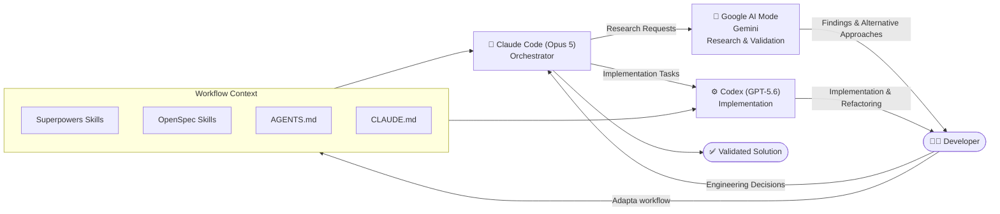

# AI_PROCESS.md

## Overview

Este documento resume cómo utilicé herramientas de IA durante el desarrollo del proyecto. La IA fue un acelerador para investigación, diseño, implementación y validación, pero las decisiones finales siempre fueron tomadas y verificadas por mí.

## Timeline

1. Investigación inicial de EVM y construcción del fixture canónico.

2. Definición iterativa del PRD, ADRs y especificaciones.

3. Diseño de arquitectura y contratos.

4. Implementación guiada por especificaciones.

5. Validación mediante fixtures, pruebas y revisión de resultados.

6. Ajustes finales y documentación.

---

# Herramientas de IA utilizadas

| Herramienta | Uso principal | ¿Por qué la elegí? |

|------------|---------------|--------------------|

| **Claude Code (Opus 5)** | Agente orquestador del desarrollo. Planificación, coordinación del workflow y revisión de decisiones utilizando una adaptación de Superpowers y OpenSpec. | Excelente manejando contexto y razonamiento de alto nivel. |

| **Codex (GPT-5.6)** | Implementador principal. Ejecutó tareas concretas de desarrollo siguiendo las especificaciones definidas durante la planificación. | Muy eficiente implementando cambios de forma consistente. |

| **Google AI Mode** | Investigación técnica y búsqueda de documentación. | Me permitió contrastar conceptos con información reciente. |

| **Gemini** | Perspectivas alternativas y validación cruzada. | Evité depender de una única IA para decisiones importantes. |

---

# Workflow de IA

No utilicé las herramientas de manera aislada.

Tomé como base las *skills* de **Superpowers** y **OpenSpec**, adaptándolas para trabajar con `AGENTS.md` y `CLAUDE.md` como fuentes principales de contexto. En algunos casos también ajusté *skills* de OpenSpec para evitar colisiones entre ellas.

Cada herramienta tuvo un rol definido:

- Claude Code → orquestación.

- Codex → implementación.

- Google AI Mode y Gemini → investigación y contraste de ideas.

Mi objetivo fue construir un flujo de trabajo donde cada modelo aportara en aquello donde era más fuerte, manteniendo siempre el criterio técnico como responsabilidad mía.

---

# Historial de prompts

Todos los prompts utilizados durante el desarrollo fueron registrados textualmente y en orden cronológico.

Se encuentran en los siguientes documentos:

- `docs/Prompt log - Init EVM Research.md`

- `docs/Prompt log - Product Specs.md`

Estos archivos forman parte del repositorio y contienen el historial completo de interacción con las herramientas de IA.

---

# Cómo aprendí EVM

Antes de pensar en la implementación, mi objetivo fue entender el problema de negocio y el dominio.

La primera interacción con la IA fue pedirle explícitamente:

> "Explícame el problema y los conceptos de dominio y negocio, teniendo en cuenta el contexto técnico también. Explica para alguien que no sabe nada del problema de dominio para ayudarle a interiorizar y entender a fondo el problema."

A partir de esa base comencé la investigación de Earned Value Management (EVM), enfocándome primero en comprender el significado de las métricas y su relación con el estado real de un proyecto, antes de analizar fórmulas o escribir código.

Durante esta fase le pedí a la IA construir un **fixture canónico de EVM** que sirviera como escenario de referencia. La idea era evolucionarlo a medida que el producto tomaba forma y, al final, convertirlo en la base de las pruebas automatizadas.

El propio modelo me sugirió tomar ese fixture y resolver los cálculos manualmente antes de implementar las fórmulas.

Seguí esa recomendación utilizando **papel y calculadora**, verificando paso a paso que los resultados tuvieran sentido y entendiendo cómo se relacionaban las métricas entre sí, en lugar de limitarme a aceptar los números generados por la IA.

Una vez validado el razonamiento, el mismo fixture se convirtió en la referencia utilizada por el código y las pruebas.

---

# Decisiones donde no seguí completamente la IA

## 1. Clasificación de CPI/SPI en los límites

Durante la construcción del fixture apareció un caso donde un valor como `0.98912` se mostraba como `0.99`, pero seguía estando fuera de la tolerancia.

La IA planteó el dilema entre priorizar la clasificación real o la consistencia visual.

Decidí no escoger una sola opción.

La clasificación siempre utiliza el valor completo (verdad del dominio), mientras que la presentación mantiene dos decimales. Cuando el redondeo oculta que se cruzó un límite, la interfaz muestra un operador (`<` o `>`) para evitar contradicciones visuales.

Con esto se conserva la precisión del dominio sin afectar la experiencia del usuario.

## 2. Alcance del dashboard

La IA propuso construir un dashboard con análisis de portafolio cuando existieran varios proyectos.

Decidí mantener el dashboard enfocado únicamente en el proyecto seleccionado.

Aunque el análisis de portafolio era una buena idea, estaba fuera del alcance del reto y aumentaba considerablemente la complejidad. Preferí invertir ese tiempo en fortalecer las funcionalidades principales.

---

# Validación de cálculos

No di por correcto el resultado únicamente porque el código compilara o las pruebas pasaran.

La validación consistió en:

- Resolver manualmente el fixture utilizando papel y calculadora.

- Comparar esos resultados con los obtenidos por la implementación.

- Verificar que los números tuvieran sentido desde la perspectiva del dominio, no solamente desde la perspectiva del código.

---

# Decisión de arquitectura independiente

Decidí utilizar **Next.js como framework Full Stack**, separando claramente la lógica de dominio de la capa de aplicación.

La IA tendía a orientar la solución hacia un stack tradicional con frontend y backend independientes.

Consideré que, para el alcance del ejercicio, Next.js ofrecía un mejor balance entre simplicidad y mantenibilidad. La separación entre dominio e infraestructura quedó definida por la arquitectura del proyecto, utilizando el framework principalmente como scaffold y no como el centro de la lógica de negocio.

---

# ¿Qué haría diferente?

Principalmente dos cosas.

**1. Profundizar más la investigación inicial.**

Aunque reduje el alcance lo más posible, durante la fase documental aparecieron varios casos límite y decisiones de producto que consumieron más tiempo del esperado. Un pequeño conjunto de prompts orientados exclusivamente a encontrar errores comunes, edge cases y decisiones importantes probablemente habría reducido varias iteraciones posteriores.

**2. Evaluar primero el framework antes de congelar los contratos.**

Definí OpenAPI muy temprano porque quería habilitar paralelismo entre diseño e implementación. Más adelante descubrí que algunos frameworks (por ejemplo FastAPI) tienen convenciones y validaciones que pueden influir en la forma natural de modelar ciertos contratos. En un próximo proyecto validaría primero esa compatibilidad antes de considerar el contrato estable.

---

# Reflexión final

La IA aceleró gran parte del desarrollo, pero nunca reemplazó el criterio de ingeniería.

La utilicé para investigar, cuestionar decisiones, generar alternativas y acelerar la implementación. Sin embargo, cada decisión importante fue respaldada por análisis propio, validación manual cuando el dominio lo requería y una revisión consciente de los trade-offs.

Mi mayor aprendizaje fue que el verdadero valor de la IA no está en escribir código por uno, sino en ayudar a pensar mejor y más rápido.